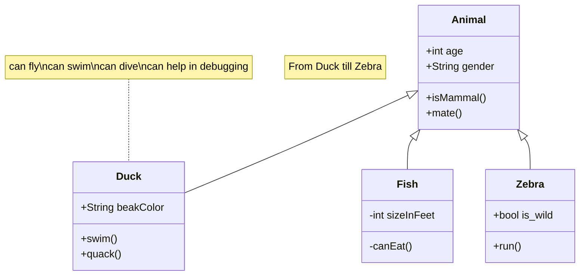

### support mermaid



### Code folding is supported by default

```js
var myArr = [1,2]
console.log(myArr)

var myObj = {a: 1, b: 2}

for(let key of myArr){
  console.log(key)
}

var it = myArr[Symbol.iterator]()
it.next() // {value: 1, done: false}

// VM704:12 Uncaught TypeError: myObj is not iterable
for(let key of myObj){
  console.log(key)
}

```