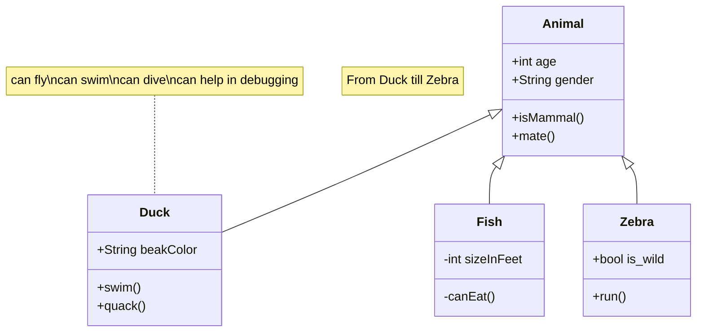

### Support Github Card

::github{repo="cirry/astro-yi"}

### Support collapse

```bash
:::collapse
Hello World!
:::
```


:::collapse
Hello World!
:::

### Support admonitions

```markdown
:::tip[Customized Title]
hello world
:::

:::note
note
:::

:::caution
caution
:::

:::danger
danger
:::

```

:::tip[Customized Title]
hello world
:::

:::note
note

```js
console.log('hello world')
```

:::

:::caution
caution
:::

:::danger
danger
:::


### Support mermaid

Use:

+ start with **```mermaid**
+ end with **```**
+ set markdown frontmatter `mermaid: true`.

Mermaid Code:

```html title="mermaid.md"
classDiagram
    note "From Duck till Zebra"
    Animal <|-- Duck
    note for Duck "can fly\ncan swim\ncan dive\ncan help in debugging"
    Animal <|-- Fish
    Animal <|-- Zebra
    Animal : +int age
    Animal : +String gender
    Animal: +isMammal()
    Animal: +mate()
    class Duck{
        +String beakColor
        +swim()
        +quack()
    }
    class Fish{
        -int sizeInFeet
        -canEat()
    }
    class Zebra{
        +bool is_wild
        +run()
    }
```

Result:



### Support mathjax

+ set markdown frontmatter `mathjax: true`.

#### Block Mode

```yaml title="Mathjax.md"
---
mathjax: true
---
hello!
$$ \sum_{i=0}^N\int_{a}^{b}g(t,i)\text{d}t $$
hello!
```

hello! 
$$ \sum_{i=0}^N\int_{a}^{b}g(t,i)\text{d}t $$
hello!

#### Inline Mode

```yaml title="Mathjax.md"
---
mathjax: true
---
hello! $ \sum_{i=0}^N\int_{a}^{b}g(t,i)\text{d}t $ hello!
```

hello! $ \sum_{i=0}^N\int_{a}^{b}g(t,i)\text{d}t $ hello!

### Integration with Expressive Code

For more usage, please refer to the official website [expressive-code](https://expressive-code.com/).

```js title="line-markers.js" del={2} ins={3-4} {6}
function demo() {
  console.log('this line is marked as deleted')
  // This line and the next one are marked as inserted
  console.log('this is the second inserted line')

  return 'this line uses the neutral default marker type'
}
```

### Code folding is supported by default

```js
var myArr = [1,2]
console.log(myArr)

var myObj = {a: 1, b: 2}

for(let key of myArr){
  console.log(key)
}

var it = myArr[Symbol.iterator]()
it.next() // {value: 1, done: false}

// VM704:12 Uncaught TypeError: myObj is not iterable
for(let key of myObj){
  console.log(key)
}

```
